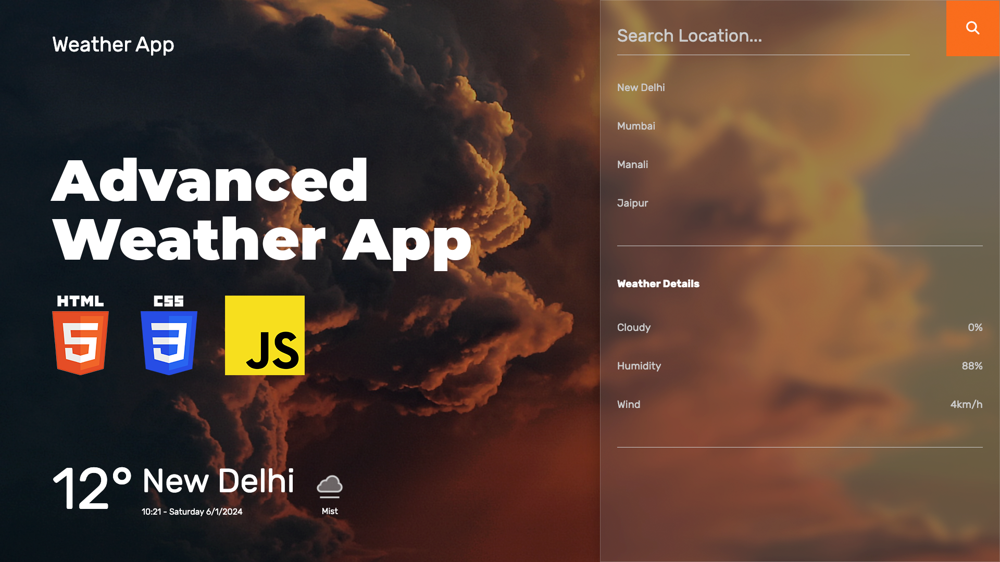

# Advanced Weather App using JavaScript and Weather API | Creating Weather App Using HTML CSS JavaScript

The Advanced Weather App, built using JavaScript and a Weather API, represents a comprehensive tutorial on creating a dynamic and feature-rich weather application. This guide takes developers through the process of constructing a weather app from scratch, leveraging HTML for structure, CSS for styling, and JavaScript for interactive functionality. By incorporating a Weather API, the tutorial enables developers to fetch real-time weather data, offering users accurate and up-to-date information. This Advanced Weather App tutorial provides insights into integrating advanced features, ensuring developers can create a polished and user-friendly weather application with ease.

Youtube Tutorial Link: https://youtu.be/lw82wBszq0I

